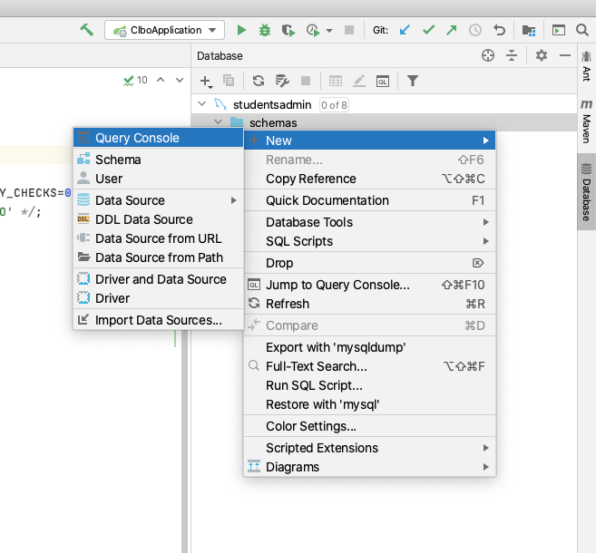
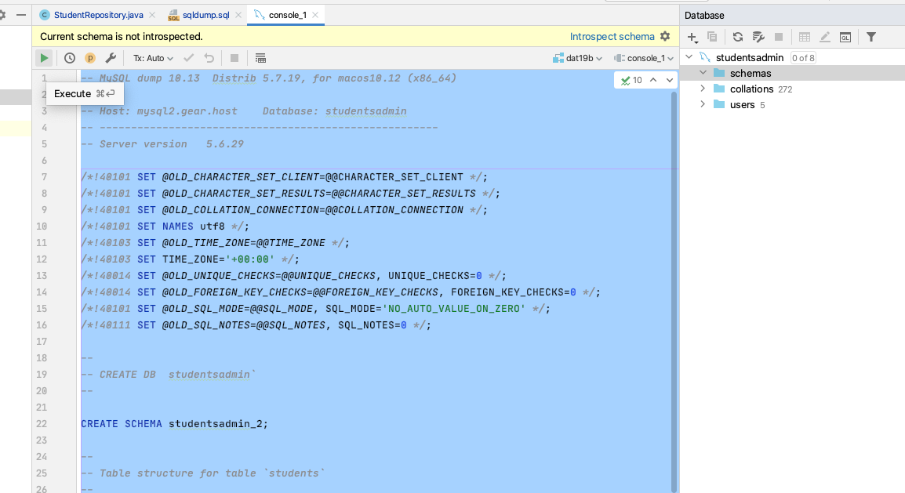
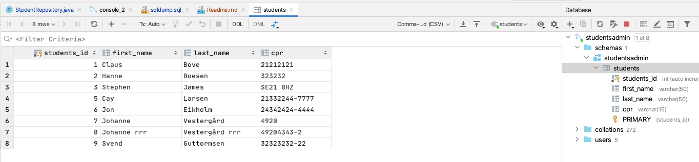
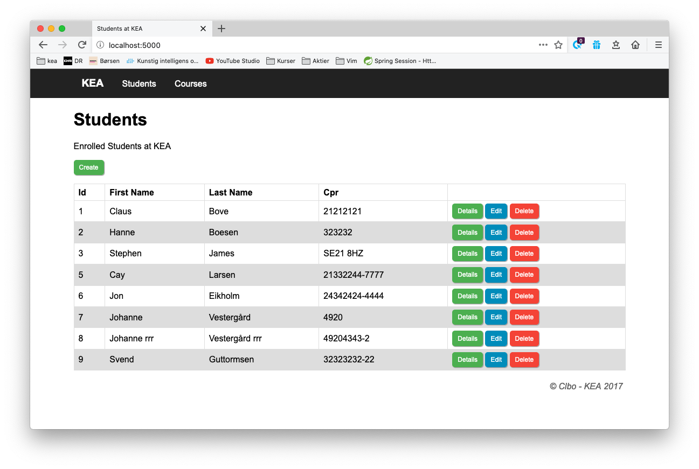

# Demo Project for Unittesting with JUnit5 and Mockito
This project is for demos at the blackboard during teachings. You should follow along while we do live coding. Afterwards you will do some exercises connected to this project.


## Setup

Clone this project:


````
    $ git clone 
````

And open it in IntelliJ

### Database
Create or open a connection to your DB Server.    

Right click on 'schemas' and open a **Query Console**.  



Open the **sqldump.sql** file from the sqldump folder, and copy/paste this into the **Query Console**, Select all (ctrl-a) and click the **Execute** button in the to left. 
 


Now you have the database 'studentsadmin' and if you double click on the students table you should see this:




### Run the project
If you run the project you should at http://localhost:5000 see this.


You are now ready to follow along!